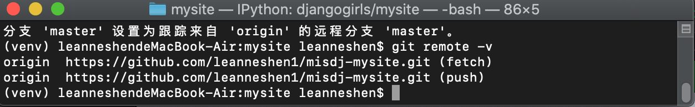

# misdj-mysite
在不同的目录下上传代码到GitHub会对应到不同的repository

举例说明：

1. 在目录(venv) leanneshendeMacBook-Air:mysite leanneshen$ 下运行 git remote -v

2. 在目录(venv) (venv) leanneshendeMacBook-Air:misdj005-master leanneshen$ 下运行 git remote -v

